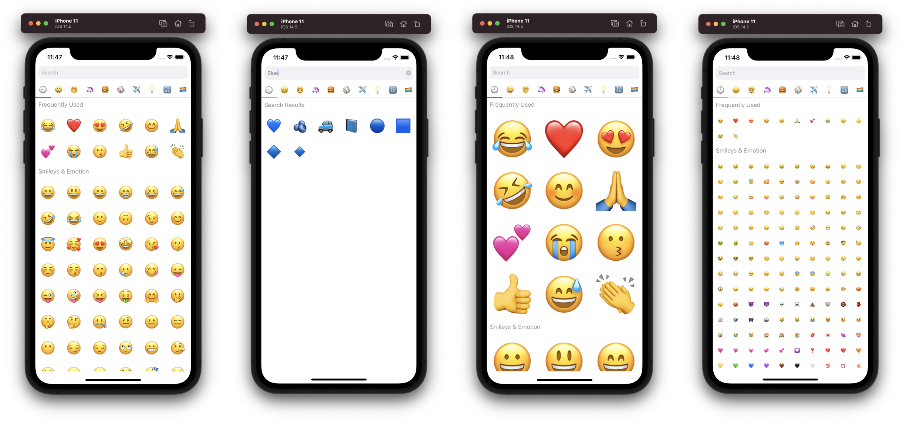

# react-native-emoji-selector



## Installation

```bash
npm install --save taskade/react-native-emoji-selector
```

```tsx
import EmojiSelector from 'react-native-emoji-selector'
```

## Demo


## Usage

### Basic usage

```tsx
<EmojiSelector onEmojiSelected={emoji => console.log(emoji)} />
```

## Props

| Prop              | Type     | Default       | Description                                              |
| ----------------- | -------- | ------------- | -------------------------------------------------------- |
| onEmojiSelected   | _func_   |               | Function called when a user selects an Emoji             |
| showTabs          | _bool_   | `true`        | Toggle the tabs on or off                                |
| showSearchBar     | _bool_   | `true`        | Toggle the searchbar on or off                           |
| showHistory       | _bool_   | `false`       | Toggle the history tab on or off                         |
| showSectionTitles | _bool_   | `true`        | Toggle the section title elements                        |
| columns           | _number_ | `6`           | Number of columns accross                                |
| placeholder       | _string_ | `"Search"` | A string placeholder when there is no text in text input |
| darkMode          | _bool_   | `false`       | Toggle dark mode on or off                               |
| shouldInclude     | _func_   |               | Function called to check for emoji inclusion             |
| theme             | _object_ | See below   | Theme colors used for the emoji picker    |

### Theme

| Prop              | LIGHT_THEME   | DARK_THEME    | Description                                              |
| ----------------- | ------------- | ------------- | -------------------------------------------------------- |
| primary           | `"#007AFF"`   | `"#0A84FF"`   | Color used for loaders and active tab indicator           |
| background        | `"#FFFFFF"`   | `"#333333"`   | Color used for picker and header background               |
| label             | `"#8F8F8F"`   | `"#8F8F8F"`   | Color used for the header text                                |
| underlay          | `"#F0F0F0"`   | `"#424242"`   | Color used when an emoji is pressed                           |
| searchBackground  | `"#F2F2F7"`   | `"#48484A"`   | Color used for the search container                           |
| searchPlaceholder | `"#00000056"` | `"#FFFFFF56"` | Color used for the search placeholder                         |
| searchText        | `"#00000087"` | `"#FFFFFF87"` | Color used for search text                                |

## Contributors

Special thanks to everyone who has contributed to this project!

[](https://github.com/victorkvarghese)
[](https://github.com/ma96o)
[](https://github.com/mateosilguero)
[](https://github.com/St1ma)
[](https://github.com/sseppola)
[](https://github.com/lucasfeijo)
[](https://github.com/alphatrl)
